# Sagewell

**Chat with your own documents.** Upload a PDF, Word file, text file, or CSV, paste some text, or add a web page. Then ask questions. Sagewell answers **only from your sources** and shows you the exact passages it used.

It is an open-source alternative to Google's NotebookLM. You control the database, the search index, and the AI keys.

---

## Table of contents

1. [What it does](#what-it-does)
2. [Big picture](#big-picture)
3. [Architecture](#architecture)
4. [Workflows](#workflows)
5. [Data model](#data-model)
6. [How answers are found (retrieval)](#how-answers-are-found-retrieval)
7. [Source status lifecycle](#source-status-lifecycle)
8. [Deployment](#deployment)
9. [Project structure](#project-structure)
10. [Run it on your computer](#run-it-on-your-computer)
11. [Using the app](#using-the-app)
12. [Tech stack](#tech-stack)

---

## What it does

| You want to... | Sagewell does... |
|---|---|
| Add a file | Reads it, splits it into small pieces, and makes it searchable. |
| Add a web page | Downloads the page, takes out the clutter, and makes it searchable. |
| Ask a question | Finds the most relevant pieces, then writes an answer from them with citations. |
| Get a quick overview | Gives each source a title and a short summary when it is processed. |
| Keep things organised | Lets you rename, pin, and delete chats and sources. |
| Remember you | Keeps a few durable facts about you across chats (optional). |

**Supported sources:** PDF, DOCX, TXT, CSV, pasted text, and web pages.

---

## Big picture

Sagewell has three running parts. Each one has one job:

- **Frontend**: the website you click on.
- **API**: receives your requests, checks who you are, and answers quickly.
- **Worker**: does the slow jobs in the background (reading files, creating search data, writing summaries).

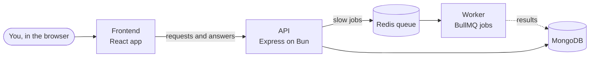

Why a queue? Reading a 200-page PDF and creating search data can take minutes. The API adds a job to the queue and replies right away. The worker picks the job up and does the work, so the website never freezes.

---

## Architecture

### Components

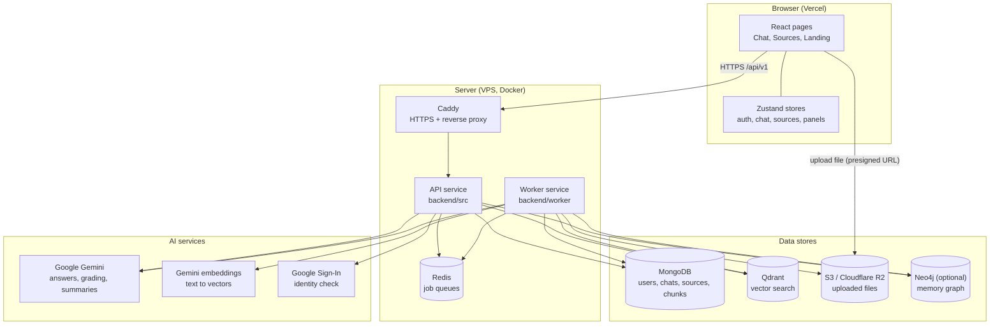

### What each part is for

| Part | Folder | Plain-English job |
|---|---|---|
| Frontend | `frontend/` | Shows the pages, sends your clicks to the API, and shows the streamed answers. |
| API | `backend/src/` | Checks your login, validates input, saves data, queues jobs, searches, and streams answers. |
| Worker | `backend/worker/` | Runs background jobs: process a source, delete a source, summarise a chat, save memories, store traces. |
| Shared code | `backend/shared/` | Database models, connections to MongoDB, Redis, Qdrant, S3, Neo4j, and the Gemini helper. Used by both API and worker. |
| Infrastructure | `backend/docker-compose.*.yml`, `infra/`, `.github/workflows/` | Docker setup, Nginx and Caddy config, and the deploy pipeline. |

### Why these tools

- **MongoDB** stores the "normal" data: users, chats, sources, and text chunks.
- **Qdrant** stores the **vectors** (numbers that represent meaning). It finds passages that are similar in meaning to your question.
- **Redis + BullMQ** hold the job queue, so slow work happens in the background.
- **S3 / R2** holds the original files, so you can view them later.
- **Neo4j** is optional. It stores a graph of facts about you for memory.

---

## Workflows

### 1. Login (Google Sign-In)

Sagewell uses Google to sign you in. The browser gets a Google token, the API checks it with Google, and then issues Sagewell's own login cookies.

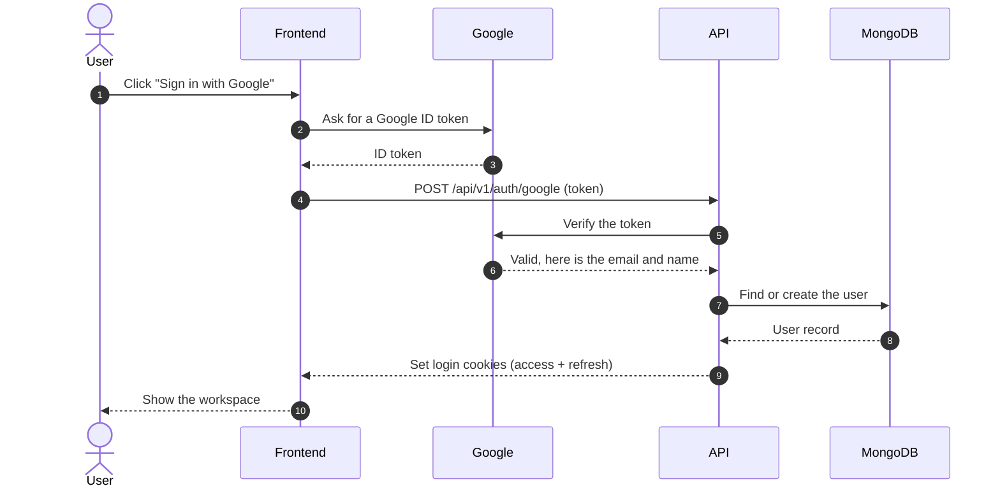

Later requests use the access cookie. When it expires, `POST /auth/refresh` gets a new one. `GET /auth/logout` clears the cookies.

### 2. Adding a file (upload)

The file goes **straight to storage**, not through the API. This keeps large uploads fast. The API only handles the paperwork.

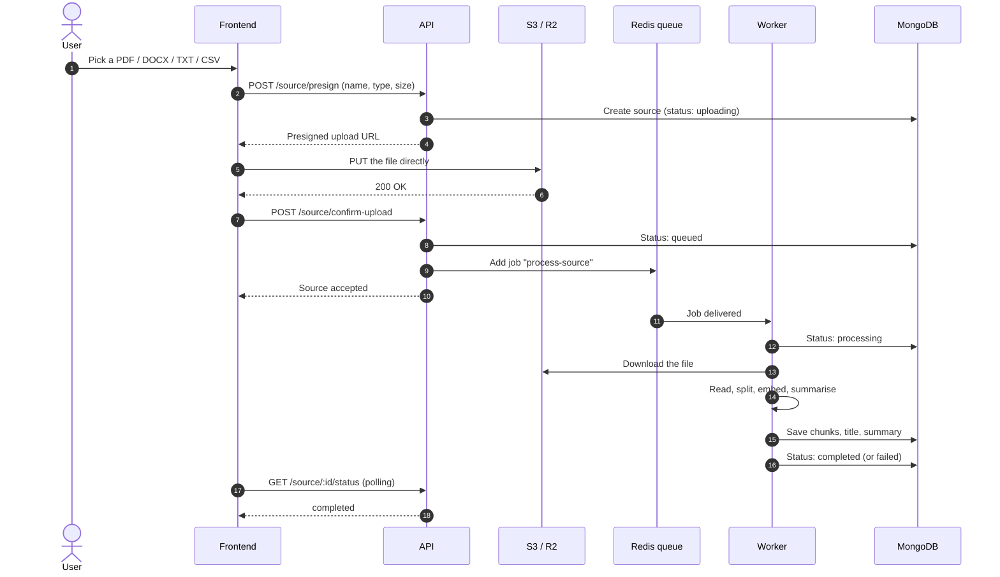

Adding **pasted text** or a **web link** skips the upload step. The API creates the source and queues the same `process-source` job. The worker then fetches the web page, or uses the text as is.

### 3. Processing a source (inside the worker)

This is what the worker does with every new source.

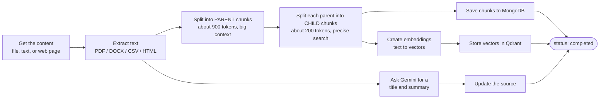

**Why two chunk sizes?** Small chunks find the right spot accurately. Bigger parent chunks give the answer enough surrounding text so it does not sound cut off. The search finds a small chunk, then the system swaps in its parent.

### 4. Asking a question (chat with streaming)

This is the main workflow. The answer appears word by word, and the first message tells the browser which passages were used.

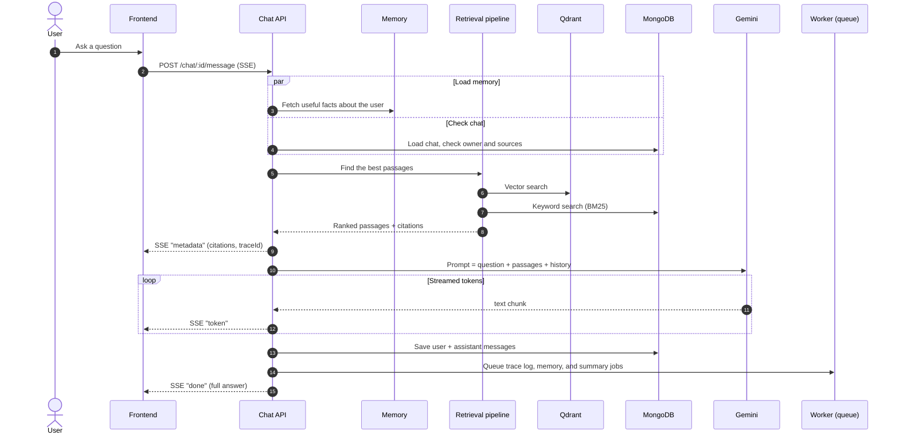

If you press **Stop**, the browser closes the stream. The API sees the disconnect, stops calling Gemini, and keeps the partial answer.

### 5. Deleting a source

Deleting a source removes a lot of data. It runs as a background job so the screen does not freeze.

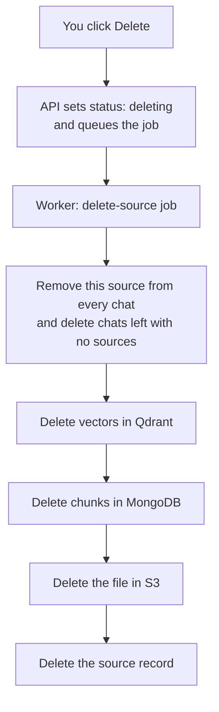

### 6. Background jobs at a glance

| Queue | Trigger | What the worker does |
|---|---|---|
| `process-source` | New file, text, or web link | Extract, chunk, embed, summarise |
| `delete-source` | You delete a source | Clean up chats, vectors, chunks, and files |
| `chat-summary` | Every 30 messages in a chat | Shrink old history into a rolling summary |
| `memory-extraction` | Every 40 messages in a chat | Save durable facts about you |
| `trace-logging` | Every answer | Save timing and step details for debugging |

---

## Data model

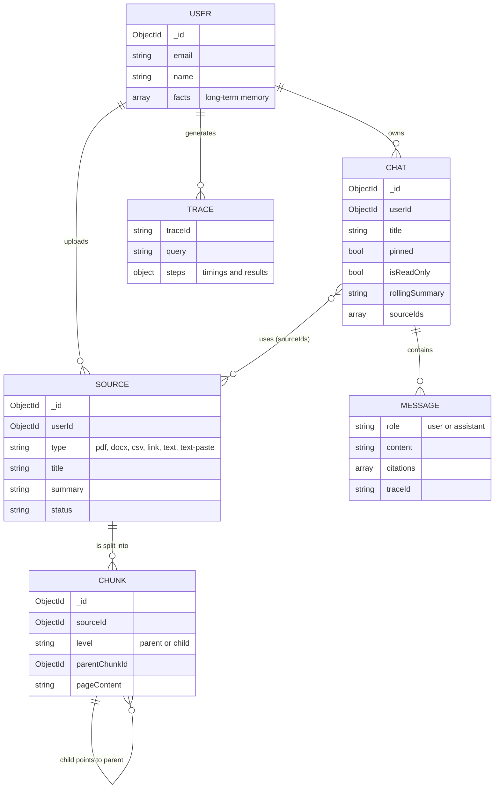

Every query is filtered by `userId`, so one user can never read another user's data.

---

## How answers are found (retrieval)

Retrieval is the step that picks the passages for the answer. It is the heart of Sagewell.

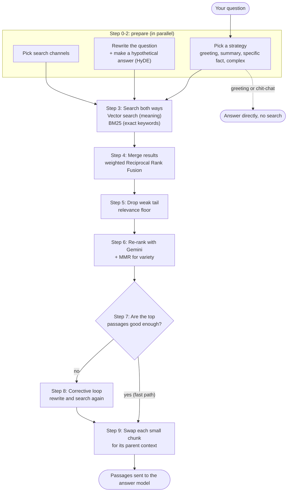

| Step | Plain English |
|---|---|
| Strategy | Decide how to search. A "summarise this" question needs a different search from "what is the date in section 3?" |
| Rewrite + HyDE | Make the question clearer. HyDE writes a short imagined answer and searches with that too. |
| Vector + BM25 | Vector search finds similar **meaning**. BM25 finds exact **words**. Using both catches more. |
| RRF | Combine both ranked lists into one. |
| Relevance floor | Cut off the weak tail so the model is not distracted. |
| Re-rank + MMR | Gemini re-orders the best candidates. MMR makes sure they are not all the same paragraph. |
| CRAG loop | If the passages are not good enough, rewrite the search and try again. |
| Parent expansion | Replace each small match with its larger parent text. |

---

## Source status lifecycle

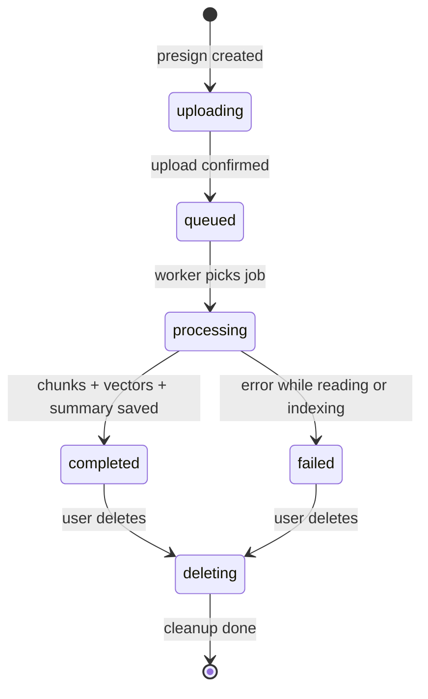

The browser checks `GET /source/:id/status` until the status is `completed` or `failed`.

---

## Deployment

Images are built in GitHub Actions, pushed to Docker Hub, and then pulled onto a VPS. The frontend is hosted on Vercel.

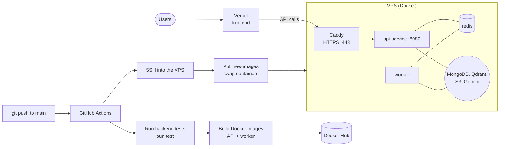

The deploy job waits for the tests to pass. It also does not cancel a deploy that is already running, so the containers are never left half-swapped.

---

## Project structure

```
.
├── frontend/                 React + Vite app (Vercel)
│   └── src/
│       ├── pages/            Landing page, workspace dashboard
│       ├── components/       Chat, sources, citations, command palette
│       └── stores/           Zustand state: auth, chat, sources, panels
├── backend/
│   ├── src/                  API server
│   │   ├── routes/           URL to controller mapping
│   │   ├── controllers/      Request handling
│   │   ├── retrieval/        Search pipeline (steps 0 to 9)
│   │   ├── evaluation/       Golden datasets, ablations, AI judge
│   │   ├── middlewares/      Auth, rate limit, validation, errors
│   │   └── dto/              Input rules (zod)
│   ├── worker/               Background job workers
│   │   └── processors/       One file per job type
│   ├── shared/               Used by API and worker
│   │   ├── libs/             DB, Redis, Qdrant, S3, Neo4j, Gemini helpers
│   │   └── models/           Mongoose schemas
│   ├── tests/                bun test suites
│   └── docker-compose.*.yml  Local and server Docker setups
├── infra/                    Nginx config and production env example
└── .github/workflows/        CI and deploy pipeline
```

---

## Run it on your computer

### What you need

- [Bun](https://bun.sh) (runs the API)
- Node.js 18 or newer (runs the worker and the frontend)
- **MongoDB**, **Redis**, and **Qdrant** running
- Optional: **Neo4j** (memory graph) and **S3 / Cloudflare R2** (file storage)
- A Google Gemini API key, and a Google OAuth client ID for sign-in

### Steps

Open **three terminals**.

```bash
# Terminal 1: the API
cd backend
bun install
cp .env.example .env     # then fill in your keys
bun run dev              # http://localhost:8080
```

```bash
# Terminal 2: the worker (required, or new sources stay "processing")
# It reuses backend/node_modules from step 1. Do NOT run npm install inside
# backend/worker: two copies of the AI SDK would break Gemini. worker/package.json
# is only used by the Docker image.
cd backend/worker
node index.js
```

```bash
# Terminal 3: the frontend
cd frontend
npm install
npm run dev              # http://localhost:5173
```

All settings are listed in [`backend/.env.example`](backend/.env.example) and [`frontend/.env.example`](frontend/.env.example). The API checks the required variables at startup and stops with a message naming any that are missing.

### Run the tests

```bash
cd backend
bun test
```

### Run with Docker

```bash
cd backend
docker compose -f docker-compose.server.yml up --build
```

---

## Using the app

1. **Sign in** with Google.
2. **Add sources**: upload a file, paste text, or add a web link.
3. **Wait** while the source is processed. Each one gets a title and a summary.
4. **Select sources** and ask a question. The answer streams in with citations you can click.
5. **Manage** chats and sources from their menus: rename, pin, or delete.

---

## Tech stack

| Layer | Tools |
|---|---|
| Frontend | React 19, Vite, Zustand, Tailwind CSS, Radix UI / shadcn, React Router |
| API | Bun, Express 5, Zod validation, Helmet, pino logging |
| Worker | Node.js, BullMQ |
| Data | MongoDB (Mongoose), Qdrant (vectors), Redis (queues), Neo4j (optional memory graph) |
| Files | S3 / Cloudflare R2 |
| AI | Google Gemini via the AI SDK, LangChain.js for splitting and vector store |
| Auth | Google Sign-In, JWT access and refresh cookies |
| Deploy | Docker, GitHub Actions, Docker Hub, Caddy, Vercel |

---

## License

ISC (see `backend/package.json`).
